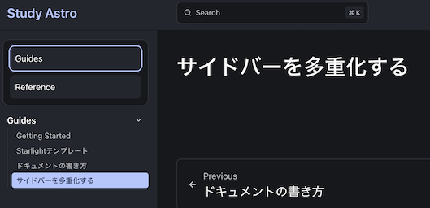

公式サイトではサイドバーが多重化（タブ化）していますが、これと似たような構造を実現します。



## docs以下のディレクトリ毎に分割する

`src/content/docs` 以下のトップディレクトリごとに分割します。以下の例では `guides` と `reference` 以下のコンテンツがそれぞれ独立したサイドバーで表示されます。

```
src/content/docs
├── guides
│   └── example.md
└── reference
    └── example.md
```

## サイドバーの上書き

通常のサイドバーの範囲ではカスタマイズが難しいため、通常のサイドバーの上部にリンクボタンを設置するようにカスタムのサイドバーを用意します。コンポーネントの上書きやカラーテーマのドキュメントを参照します。

* [Overriding Components](https://starlight.astro.build/guides/overriding-components/)
* [カラーテーマ](https://starlight.astro.build/guides/css-and-tailwind/#color-theme-editor)

`src/components/Sidebar.astro`:

```astro
---
import Default from "@astrojs/starlight/components/Sidebar.astro";

const links = [
  { label: "Guides", href: "/guides/getting-started/" },
  { label: "Reference", href: "/reference/example/" },
];

const current = Astro.url.pathname;
const isActive = (href) => {
  if (href === "/") {
    return current === "/";
  }

  const group = href.substring(0, href.indexOf('/', 1));
  return current.startsWith(group);
};
---

<nav class="my-sidebar">
  <!-- サイドバー切り替えボタン -->
  <div class="my-fixed-links">
    <div class="my-fixed-links-grid">
      {links.map((item) => (
        <a
          class={`my-fixed-link ${isActive(item.href) ? "active" : ""}`}
          href={item.href}
        >
          {item.label}
        </a>
      ))}
    </div>
  </div>

  <!-- Default Sidebar -->
  <Default><slot /></Default>
</nav>

<style>
  .my-sidebar {
    display: flex;
    flex-direction: column;
    gap: 0.75rem;
  }

  .my-fixed-links {
    padding: 0.75rem;
    border: 1px solid var(--sl-color-gray-5);
    border-radius: 0.75rem;
    background: var(--sl-color-black);
  }

  .my-fixed-links-title {
    font-size: 0.8rem;
    font-weight: 600;
    color: var(--sl-color-gray-2);
    margin-bottom: 0.5rem;
  }

  .my-fixed-links-grid {
    display: grid;
    gap: 0.5rem;
  }

  .my-fixed-link {
    display: block;
    padding: 0.5rem 0.6rem;
    border-radius: 0.6rem;
    text-decoration: none;
    color: var(--sl-color-white);
    background: var(--sl-color-gray-6);
  }

  .my-fixed-link:hover {
    background: var(--sl-color-gray-5);
  }

  .my-fixed-link.active {
    outline: 2px solid var(--sl-color-accent-high);
  }
</style>
```

`astro.config.mjs` で作成したサイドバーを使用するように設定します。

`astro.config.mjs`:

```mjs
export default defineConfig({
	integrations: [
		starlight({
			...
			components: {
				// Override the default `SocialIcons` component.
				Sidebar: './src/components/Sidebar.astro',
      		},
		}),
	],
});
```

## サイドバーに表示するページをフィルタする

リンクボタンは作成できましたが、サイドバーには全てのページが表示されているので、これを必要なもののみにフィルターします。

Starlight Examplesにそのままの例があるので、そちらから拝借します。リファレンスはRoute Dataになります。

* [Starlight Examples](https://starlight-examples.netlify.app/examples/multi-sidebar/)
* [Route Data](https://starlight.astro.build/guides/route-data/)

`src/routeMiddleware.ts`:

```ts
import { defineRouteMiddleware } from '@astrojs/starlight/route-data';

export const onRequest = defineRouteMiddleware((context) => {
	// ドキュメントのパス名から最上位の要素を取得
	// e.g. `/root/sub/` returns `/root/`
	const currentBase = context.url.pathname.split('/').slice(0, 2).join('/') + '/';

	const { pagination } = context.locals.starlightRoute;

	// サイドバーから同一階層ないにないドキュメントを取り除く
	context.locals.starlightRoute.sidebar = context.locals.starlightRoute.sidebar.filter(
		(entry) =>
			entry.type === 'group' &&
			entry.entries.some(
				(subEntry) => subEntry.type === 'link' && subEntry.href.startsWith(currentBase)
			)
	);

    // カテゴリを跨ぐページネーションリンクは作成しない
	if (pagination.prev && !pagination.prev.href.startsWith(currentBase)) {
		pagination.prev = undefined;
	}
	if (pagination.next && !pagination.next.href.startsWith(currentBase)) {
		pagination.next = undefined;
	}
});
```

作成したミドルウェアを使用するように `astro.config.mjs` で指定します。

`astro.config.mjs`:

```mjs
export default defineConfig({
	integrations: [
		starlight({
			...
			routeMiddleware: `./src/routeMiddleware.ts`
		}),
	],
});
```

## サイドバーの表示コンテンツを1階層下げる

このままでも大体良いですが、トップディレクトリがサイドバーに表示されていて冗長なので指定を１階層下げます。この構成に合わせて、 `Sidebar.astro` で定義したリンクも調整します。

`astro.config.mjs`:

```mjs
export default defineConfig({
	integrations: [
		starlight({
			sidebar: [
				{
					label: 'Guides',
					autogenerate: { directory: 'guides' },
				},
				// Reference
				{
					label: 'Sub1',
					autogenerate: { directory: 'reference/sub1' },
				},
				{
					label: 'Sub2',
					autogenerate: { directory: 'reference/sub2' },
				},
			],
		}),
	],
});
```

## GitHub Pages向けの調整

GitHub Pagesでカスタムドメインを使用しない場合、URLにはリポジトリ名が含まれます。URLが変わるため、これに合わせた調整が必要になります。

`Sidebar.astro` ではリンクを修正するほか、URLの解析時にリポジトリ名は飛ばしてトップディレクトリ名を取得するようにします。

`src/components/Sidebar.astro`:

```astro
---
import Default from "@astrojs/starlight/components/Sidebar.astro";

// link button data
const links = [
  { label: "Guides", href: "/study-astro/guides/getting-started/" },
  { label: "Reference", href: "/study-astro/reference/sub1/example1/" },
];

// checks a page is in a link group
const current = Astro.url.pathname;
const isActive = (href) => {
  if (href === "/") {
    return current === "/";
  }

  const group = href.split('/')[2];
  return current.split('/')[2] === group;
};
---
```

`routeMiddleware.ts` も同様に調整します。

`src/routeMiddleware.ts`:

```ts
export const onRequest = defineRouteMiddleware((context) => {
	// ドキュメントのパス名から最上位の要素を取得
	// e.g. `/study-astro/root/sub/` returns `/root/`
	const currentBase = context.url.pathname.split('/').slice(0, 3).join('/') + '/';
```
